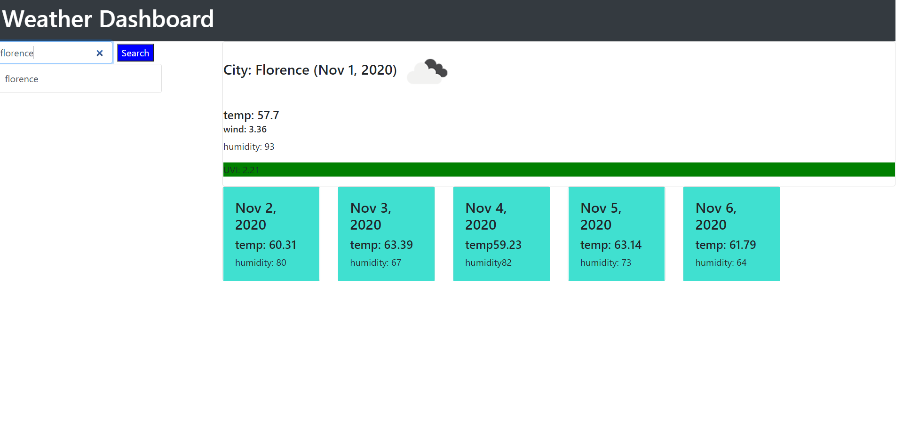

# wether

## Getting Started

My weather page
 https://zapblumar.github.io/wether/.
### Prerequisites


```
GIVEN a weather dashboard with form inputs
WHEN I search for a city
THEN I am presented with current and future conditions for that city and that city is added to the search history
WHEN I view current weather conditions for that city
THEN I am presented with the city name, the date, an icon representation of weather conditions, the temperature, the humidity, the wind speed, and the UV index
WHEN I view the UV index
THEN I am presented with a color that indicates whether the conditions are favorable, moderate, or severe
WHEN I view future weather conditions for that city
THEN I am presented with a 5-day forecast that displays the date, an icon representation of weather conditions, the temperature, and the humidity
WHEN I click on a city in the search history
THEN I am again presented with current and future conditions for that city
```


## Running the tests

I made the date show the correct day and the temp be in farenhight.
I got the uv index to change to the right color.
I was not able to get the history button to work but it is not working do to the proventDefult I needed to actualy get my fetch to work.


## Built With

* VS Code
* git

